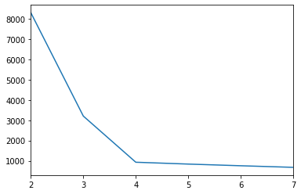

```python
%matplotlib inline

from pandas import Series, DataFrame
import pandas as pd
from sklearn.cluster import KMeans
from sklearn.datasets import make_blobs

data, true_labels = make_blobs(n_samples=500, centers=4, random_state=6)
points = DataFrame(data, columns=["x", "y"])

inertia_values = []
r = pd.RangeIndex(2, 8)
for n_clusters in r:
    kmeans = KMeans(n_clusters=n_clusters).fit(points)
    inertia_values.append(kmeans.inertia_)

inertia = Series(inertia_values, name="inertia", index=r)
inertia.plot()
```


    <matplotlib.axes._subplots.AxesSubplot at 0x7f374762f198>


    

    

