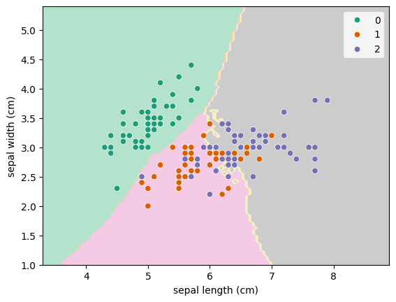

As usual, grab the data. The difference this time is that are only going to grab two of the features in order to make it a 2D problem which is easier to visualise.


```python
from pandas import DataFrame
from sklearn.datasets import load_iris
from sklearn.model_selection import train_test_split

X = DataFrame(load_iris().data, columns=load_iris().feature_names)
X = X[["sepal length (cm)", "sepal width (cm)"]]  # Grab just two of the features
y = load_iris().target

train_X, test_X, train_y, test_y = train_test_split(X, y, random_state=42)
```

We will look at values of `n_neighbors` from 0 to 59.


```python
from sklearn.model_selection import GridSearchCV
from sklearn.neighbors import KNeighborsClassifier

hyperparameters = {
    "n_neighbors" : range(1, 40),
}
clf = GridSearchCV(KNeighborsClassifier(), hyperparameters).fit(train_X, train_y)
```

To easily look at the results, we put the output into a `DataFrame`, sort it by the test score (how well that value did against its validation set) and grab the top few rows.


```python
cv_results = DataFrame(clf.cv_results_)
cv_results = cv_results.sort_values(["rank_test_score", "mean_test_score"])
cv_results.head()[["param_n_neighbors", "mean_test_score", "std_test_score", "rank_test_score"]]
```


<div>
<style scoped>
    .dataframe tbody tr th:only-of-type {
        vertical-align: middle;
    }

    .dataframe tbody tr th {
        vertical-align: top;
    }

    .dataframe thead th {
        text-align: right;
    }
</style>
<table border="1" class="dataframe">
  <thead>
    <tr style="text-align: right;">
      <th></th>
      <th>param_n_neighbors</th>
      <th>mean_test_score</th>
      <th>std_test_score</th>
      <th>rank_test_score</th>
    </tr>
  </thead>
  <tbody>
    <tr>
      <th>30</th>
      <td>31</td>
      <td>0.795652</td>
      <td>0.056227</td>
      <td>1</td>
    </tr>
    <tr>
      <th>28</th>
      <td>29</td>
      <td>0.795257</td>
      <td>0.042471</td>
      <td>2</td>
    </tr>
    <tr>
      <th>17</th>
      <td>18</td>
      <td>0.786561</td>
      <td>0.048231</td>
      <td>3</td>
    </tr>
    <tr>
      <th>27</th>
      <td>28</td>
      <td>0.786561</td>
      <td>0.048231</td>
      <td>3</td>
    </tr>
    <tr>
      <th>29</th>
      <td>30</td>
      <td>0.786561</td>
      <td>0.048231</td>
      <td>3</td>
    </tr>
  </tbody>
</table>
</div>


It looks like the best one is `n_neighbors=31` but let's look on a plot to see how it varies:


```python
cv_results.plot.scatter("param_n_neighbors", "mean_test_score", yerr="std_test_score")
```


    <Axes: xlabel='param_n_neighbors', ylabel='mean_test_score'>


    

    


Indeed `n_neighbors=31` is the best in the range but they all have large standard deviations. It's worth plotting it like this so that you might want to pick a lower mean in order to get a tighter distribution.


```python
from sklearn.inspection import DecisionBoundaryDisplay
import seaborn as sns

DecisionBoundaryDisplay.from_estimator(clf, X, cmap="Pastel2")
sns.scatterplot(data=X, x="sepal length (cm)", y="sepal width (cm)", hue=y, palette="Dark2")
```


    <Axes: xlabel='sepal length (cm)', ylabel='sepal width (cm)'>


    

    


```python
clf.score(test_X, test_y)
```


    0.868421052631579


