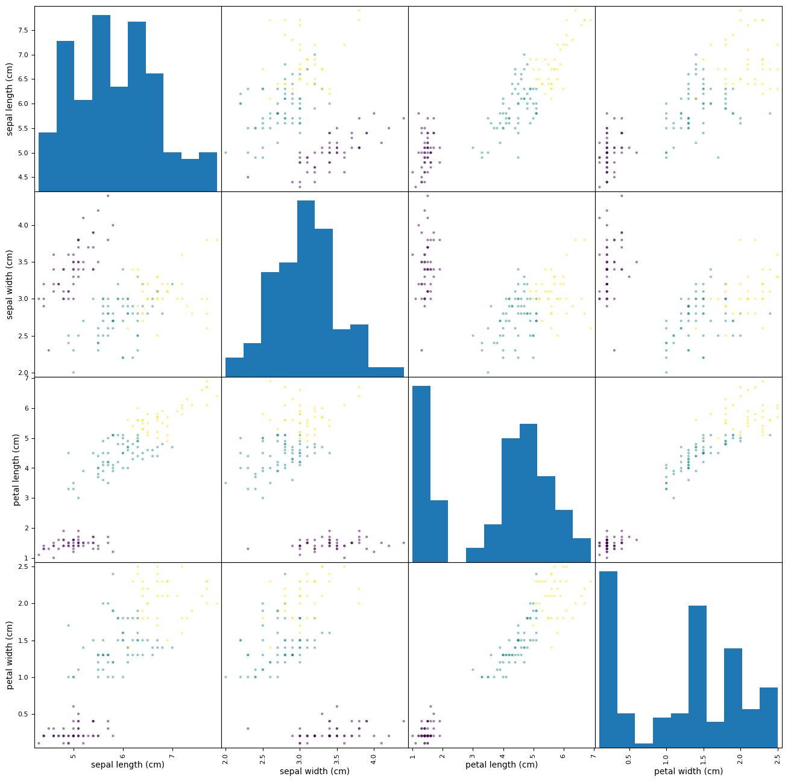

```python
%matplotlib inline

from pandas import DataFrame
from pandas.plotting import scatter_matrix
from sklearn.cluster import KMeans
from sklearn.datasets import load_iris

iris = DataFrame(load_iris().data, columns=load_iris().feature_names)

num_iris_species = len(load_iris().target_names)

kmeans = KMeans(n_clusters=num_iris_species, n_init="auto").fit(iris)

a = scatter_matrix(iris, figsize=(16, 16), c=kmeans.labels_)
```


    

    

