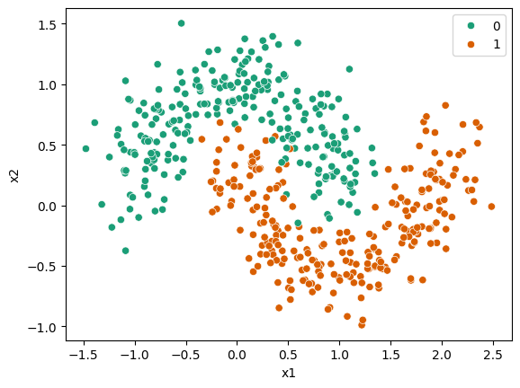

```python
import pandas as pd
import seaborn as sns
from sklearn.datasets import make_moons

X, y = make_moons(n_samples=500, noise=0.2, random_state=42)
X = pd.DataFrame(X, columns=["x1", "x2"])

sns.scatterplot(data=X, x="x1", y="x2", hue=y, palette="Dark2")
```


    <Axes: xlabel='x1', ylabel='x2'>


    

    


```python
data = X.copy()
data["y"] = y
```


```python
data.to_csv("moons.csv", index=False)
```


```python
check = pd.read_csv("moons.csv")
pd.testing.assert_frame_equal(data, check)
```
