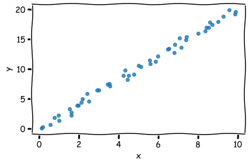
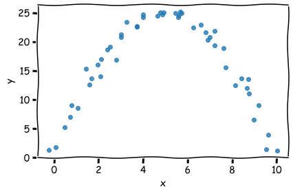

```python
import numpy as np
import matplotlib.pyplot as plt

plt.xkcd()

N_POINTS = 50
x = np.linspace(0, 10, N_POINTS)
rng = np.random.RandomState(42)
```


```python
y = x*2

x = x + (rng.normal(size=N_POINTS) * 0.25)
y = y + (rng.normal(size=N_POINTS) * 0.25)

fig, ax = plt.subplots(constrained_layout=True)
fig.set_constrained_layout_pads(w_pad=10/72, h_pad=10/72)
ax.scatter(x, y, alpha=0.8)
ax.set_xlabel("x")
ax.set_ylabel("y")

fig.savefig("linear.svg")
```


    

    


```python
y = -((x-5)**2) + 25

x = x + (rng.normal(size=N_POINTS) * 0.25)
y = y + (rng.normal(size=N_POINTS) * 0.25)

fig, ax = plt.subplots(constrained_layout=True)
fig.set_constrained_layout_pads(w_pad=10/72, h_pad=10/72)
ax.scatter(x, y, alpha=0.8)
ax.set_xlabel("x")
ax.set_ylabel("y")

fig.savefig("quadratic.svg")
```


    

    

